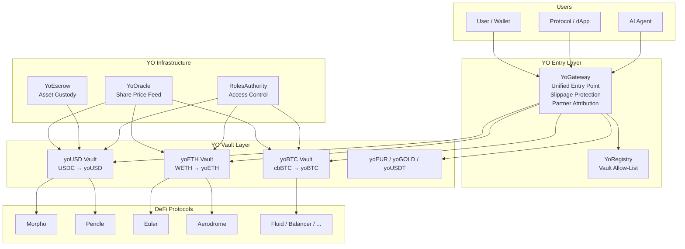
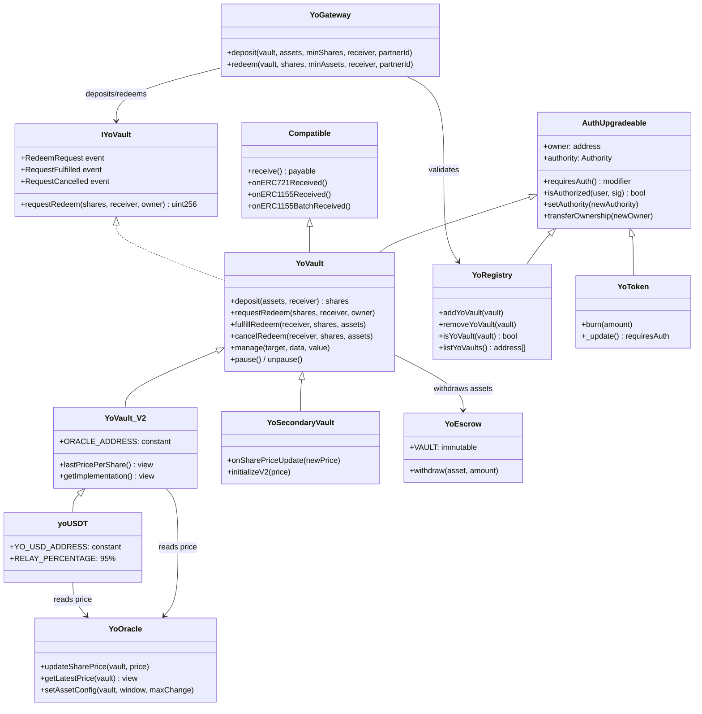

# YO Protocol Overview

## What is YO?

YO Protocol is a **multi-chain DeFi yield optimizer** that pools user assets into ERC-4626 compliant vaults ("yoVaults"), automatically rebalancing capital across the highest **risk-adjusted** yield opportunities on Ethereum and Base.

- Users deposit assets (USDC, WETH, cbBTC, etc.) and receive yield-bearing **yoTokens** (yoUSD, yoETH, yoBTC)
- Capital is deployed to audited protocols: Morpho, Pendle, Euler, Aerodrome, Fluid, Balancer, Reserve Protocol
- Risk assessment via Exponential.fi ratings (protocol age, audit history, smart contract security)
- No management or performance fees — only necessary bridging costs shared among depositors

## Architecture at a Glance

## Key Design Principles

1. **ERC-4626 Standard** — All vaults implement the tokenized vault standard. Any ERC-4626 compatible protocol can integrate.

2. **Asynchronous Redemptions** — Withdrawals may complete instantly (if vault has liquidity) or be queued (up to 24h) for operator fulfillment. Inspired by ERC-7540.

3. **Embassy Architecture** — Each chain holds native assets. Cross-chain rebalancing is handled by operators, not user funds. No bridge exposure for depositors.

4. **Oracle-Driven Pricing** — Share prices are maintained by an external oracle with anchor-based circuit breakers, not computed from on-chain TVL alone.

5. **Role-Based Access** — Operator actions (fulfilling redeems, managing assets, pausing) are gated by a Solmate-derived `RolesAuthority` system.

## Contract Hierarchy

## Vault Evolution

| Version | Pricing Model | Oracle Pattern | Key Feature |
|---------|--------------|----------------|-------------|
| **YoVault (V1)** | `balanceOf(vault) + aggregatedUnderlyingBalances` | Push: operator calls `onUnderlyingBalanceUpdate()` | Auto-pause on price deviation |
| **YoVault_V2** | Oracle price via `IYoOracle.getLatestPrice()` | Pull: vault reads oracle on every conversion | Hardcoded `ORACLE_ADDRESS` |
| **yoUSDT** | Same oracle as V2, keyed on `YO_USD_ADDRESS` | Pull: shares yoUSD's price feed | 95% deposit relay to yoUSD |
| **YoSecondaryVault** | Direct price push via `onSharePriceUpdate()` | Push: operator pushes pre-computed price | Cross-chain secondary instances |

## Files Reference

| Document | Contents |
|----------|----------|
| [01-smart-contracts.md](./01-smart-contracts.md) | Complete contract-by-contract reference |
| [02-deposit-flow.md](./02-deposit-flow.md) | Deposit mechanics with diagrams |
| [03-redemption-flow.md](./03-redemption-flow.md) | Instant + async redemption flows |
| [04-oracle-system.md](./04-oracle-system.md) | Oracle architecture and circuit breakers |
| [05-gateway-integration.md](./05-gateway-integration.md) | YoGateway as the integration surface |
| [06-sdk-reference.md](./06-sdk-reference.md) | TypeScript SDK and CLI reference |
| [07-contract-addresses.md](./07-contract-addresses.md) | Deployed addresses and vault registry |
| [08-access-control.md](./08-access-control.md) | Auth system, roles, and permissions |
