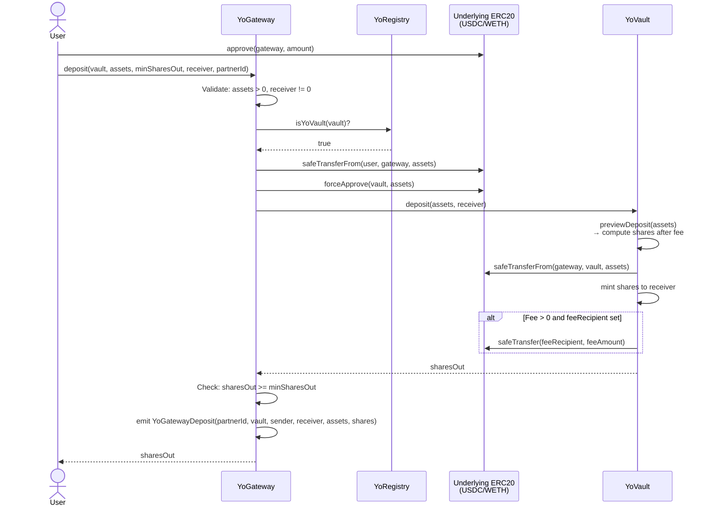
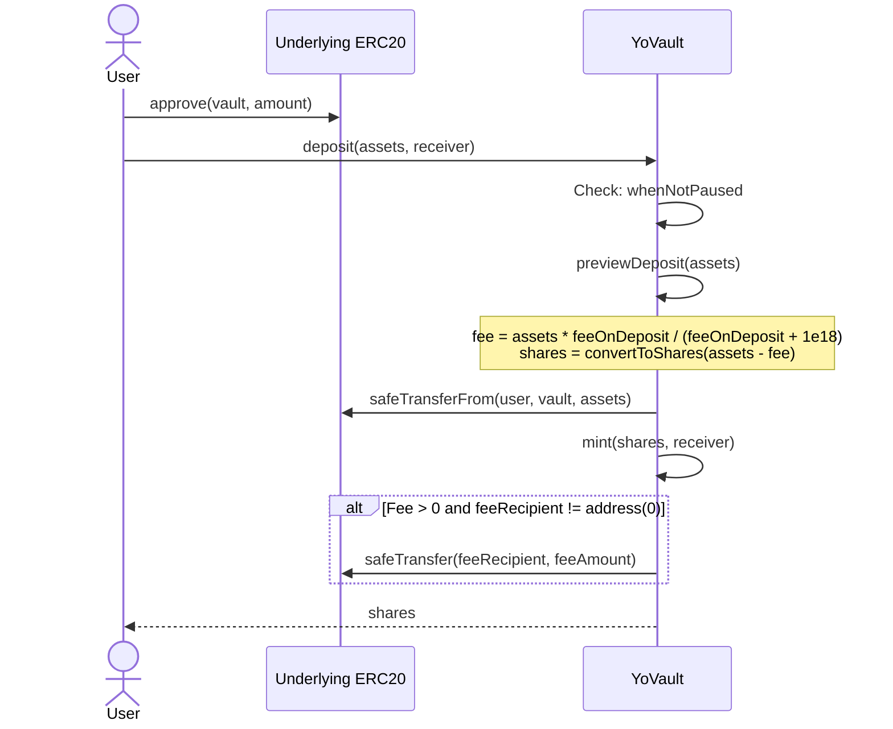
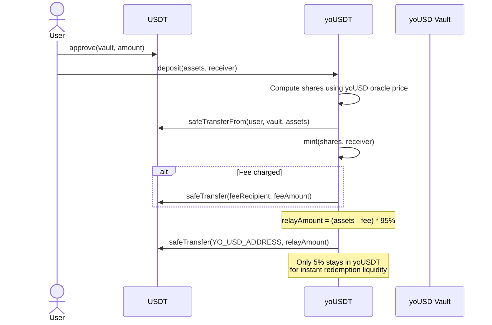

# YO Protocol — Deposit Flow

## User Story

As a user, I want to deposit my USDC/WETH/cbBTC into a YO vault and receive yield-bearing yoTokens (yoUSD/yoETH/yoBTC) that automatically earn optimized yield.

---

## Deposit via Gateway (Recommended Path)



## Deposit Directly to Vault (No Gateway)



## yoUSDT Special Case — 95% Deposit Relay



## Fee Calculation

Two fee formulas are used:

### `_feeOnTotal` (used for `deposit` and `redeem`)

Fee is extracted from the amount — the amount already includes the fee:

```
fee = assets * feeBps / (feeBps + 1e18)    // rounding: Ceil
netAssets = assets - fee
```

Example: deposit 1000 USDC with 1% fee (1e16):
- fee = 1000 * 1e16 / (1e16 + 1e18) = 1000 * 1e16 / 1.01e18 ≈ 9.90
- netAssets = 990.10 → converted to shares

### `_feeOnRaw` (used for `mint` and `withdraw`)

Fee is added on top:

```
fee = assets * feeBps / 1e18    // rounding: Ceil
totalCost = assets + fee
```

### Fee Limits

- `feeOnDeposit` and `feeOnWithdraw` must be strictly **< 1e17** (10%)
- No fee is charged if `feeRecipient == address(0)` or `feeAmount == 0`

## Share Price Calculation

### V1 (YoVault)

```
totalAssets = balanceOf(vault) + aggregatedUnderlyingBalances
shares = assets * totalSupply / totalAssets    // standard ERC4626
```

### V2 (YoVault_V2, yoUSDT)

```
(pricePerShare, _) = IYoOracle(ORACLE_ADDRESS).getLatestPrice(vaultOrYoUSDAddress)
shares = assets * 10^decimals / pricePerShare
```

## Integration Code Examples

### Via SDK (TypeScript)

```typescript
import { createYoClient, VAULTS, parseTokenAmount, YO_GATEWAY_ADDRESS } from '@yo-protocol/core'

const client = createYoClient({ chainId: 8453, walletClient })
const vault = VAULTS.yoUSD

// 1. Check vault status
const paused = await client.isPaused(vault.address)

// 2. Parse amount
const amount = parseTokenAmount('100', vault.underlying.decimals)  // 100_000_000n for USDC

// 3. Approve gateway
const hasAllowance = await client.hasEnoughAllowance(
  vault.underlying.address[8453], wallet.account.address, YO_GATEWAY_ADDRESS, amount
)
if (!hasAllowance) {
  const { hash } = await client.approve(vault.underlying.address[8453], amount)
  await client.waitForTransaction(hash)
}

// 4. Deposit
const result = await client.deposit({ vault: vault.address, amount, slippageBps: 50 })
console.log('Shares received:', result.shares)
```

### Via Solidity (Direct)

```solidity
IERC20(asset).approve(address(yoVault), amount);
uint256 shares = yoVault.deposit(amount, msg.sender);
```

### Via Solidity (Gateway)

```solidity
IERC20(asset).approve(address(gateway), amount);
uint256 minShares = gateway.quotePreviewDeposit(address(yoVault), amount);
uint256 shares = gateway.deposit(address(yoVault), amount, minShares, msg.sender, partnerId);
```
