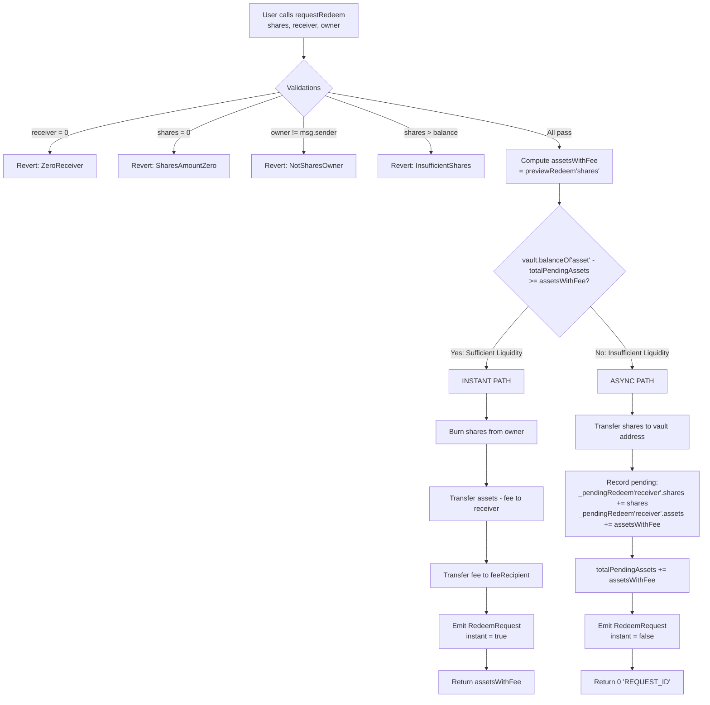
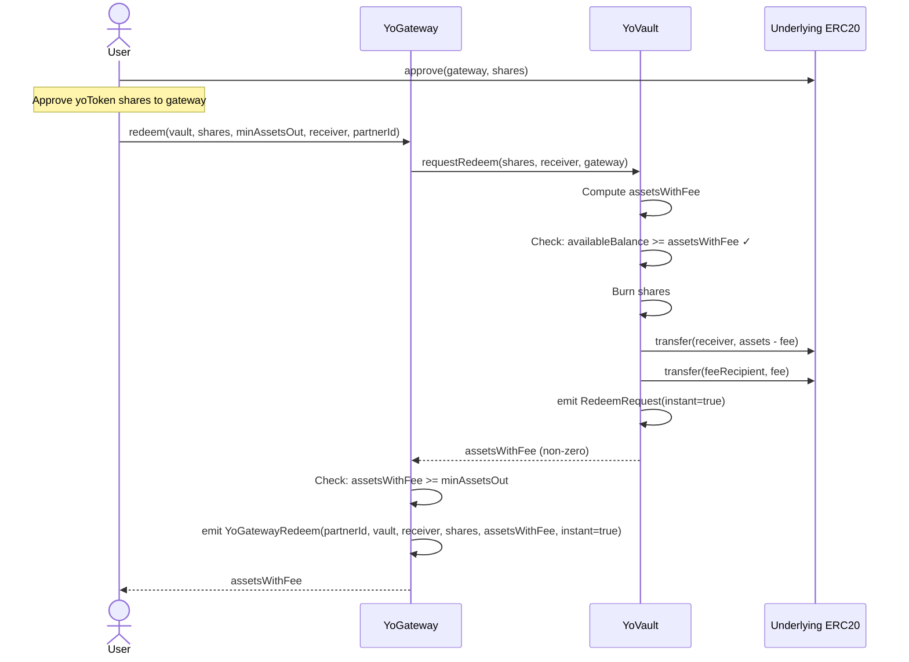
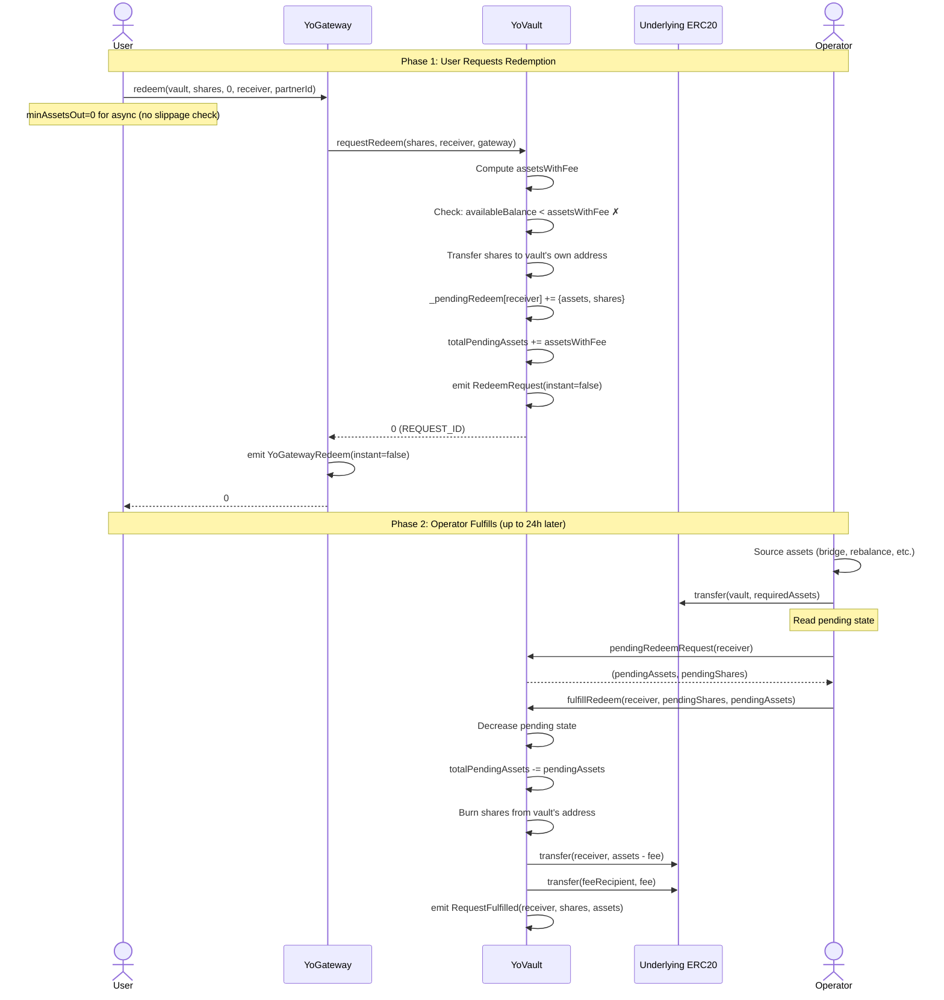
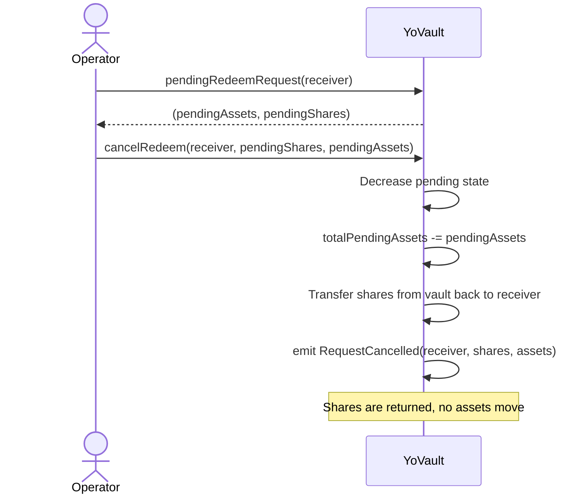
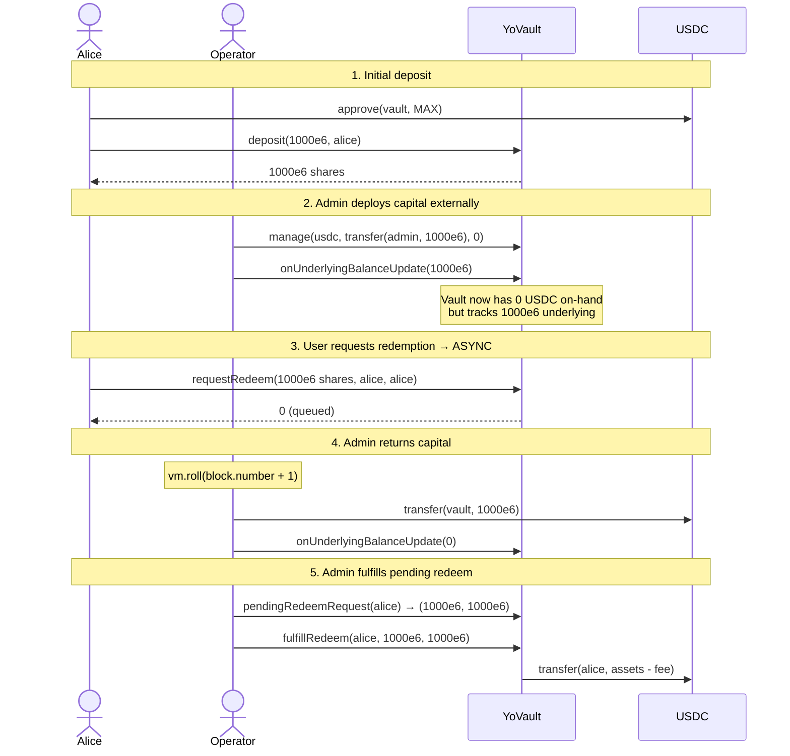

# YO Protocol — Redemption Flow

## User Story

As a user, I want to redeem my yoTokens (yoUSD/yoETH/yoBTC) back to the underlying asset (USDC/WETH/cbBTC). The redemption may be instant (if vault has liquidity) or queued (up to 24 hours).

---

## Key Design Decision

**`withdraw()` is permanently disabled** — it always reverts with `UseRequestRedeem`. Users must use `requestRedeem()` (or the gateway's `redeem()`). This is because the vault may not have sufficient on-chain liquidity at any given moment.

---

## Redemption Decision Flow



## Instant Redemption Sequence



## Async Redemption Sequence (Queued)



## Cancellation Flow



## Full Async Lifecycle (from tests)

This is the complete pattern observed in the test suite:



## Gateway vs Direct Vault Redemption

| Feature | Gateway `redeem()` | Direct `requestRedeem()` |
|---------|-------------------|-------------------------|
| Slippage protection | Built-in (`minAssetsOut`) | None |
| Partner attribution | Via `partnerId` | None |
| Approval target | Approve shares to **gateway** | Approve shares to **vault** |
| Owner parameter | Gateway is both owner and caller | `owner` must equal `msg.sender` |
| Return value | Same: assets (instant) or 0 (async) | Same |

## Reading Pending State

```solidity
// On-chain: check pending redemption for a user
(uint256 pendingAssets, uint256 pendingShares) = yoVault.pendingRedeemRequest(userAddress);

// Total pending across all users
uint256 totalPending = yoVault.totalPendingAssets();
```

```typescript
// Via SDK
const pending = await client.getPendingRedemptions(vault.address, userAddress)

// Via REST API
// GET https://api.yo.xyz/api/v1/vault/pending-redeems/{network}/{vaultAddress}
```

## Integration Code Examples

### Via SDK (TypeScript)

```typescript
import { createYoClient, VAULTS } from '@yo-protocol/core'

const client = createYoClient({ chainId: 8453, walletClient })
const vault = VAULTS.yoUSD

// Get user's shares
const shares = await client.getShareBalance(vault.address, userAddress)

// Redeem
const result = await client.redeem({ vault: vault.address, shares, slippageBps: 50 })

// Check if instant or queued
const receipt = await client.waitForRedeemReceipt(result.hash)
if (receipt.instant) {
  console.log('Assets received immediately:', receipt.assetsOrRequestId)
} else {
  console.log('Queued — check back in up to 24 hours')
  const pending = await client.getPendingRedemptions(vault.address, userAddress)
}
```
