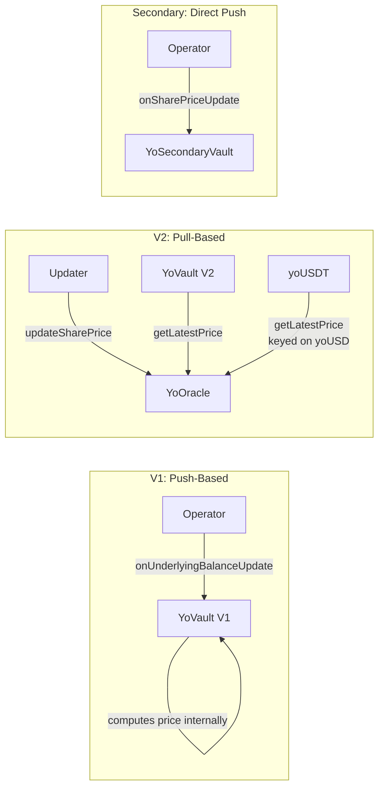
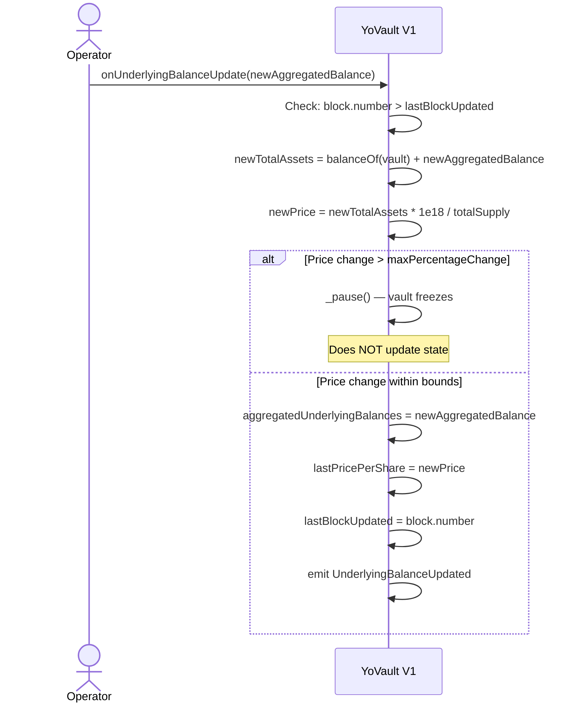
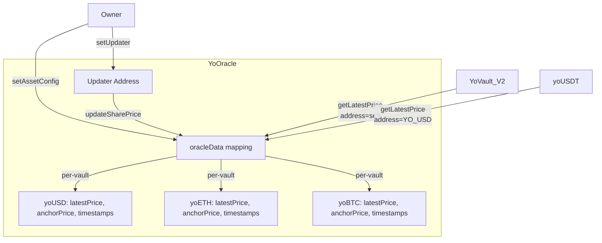
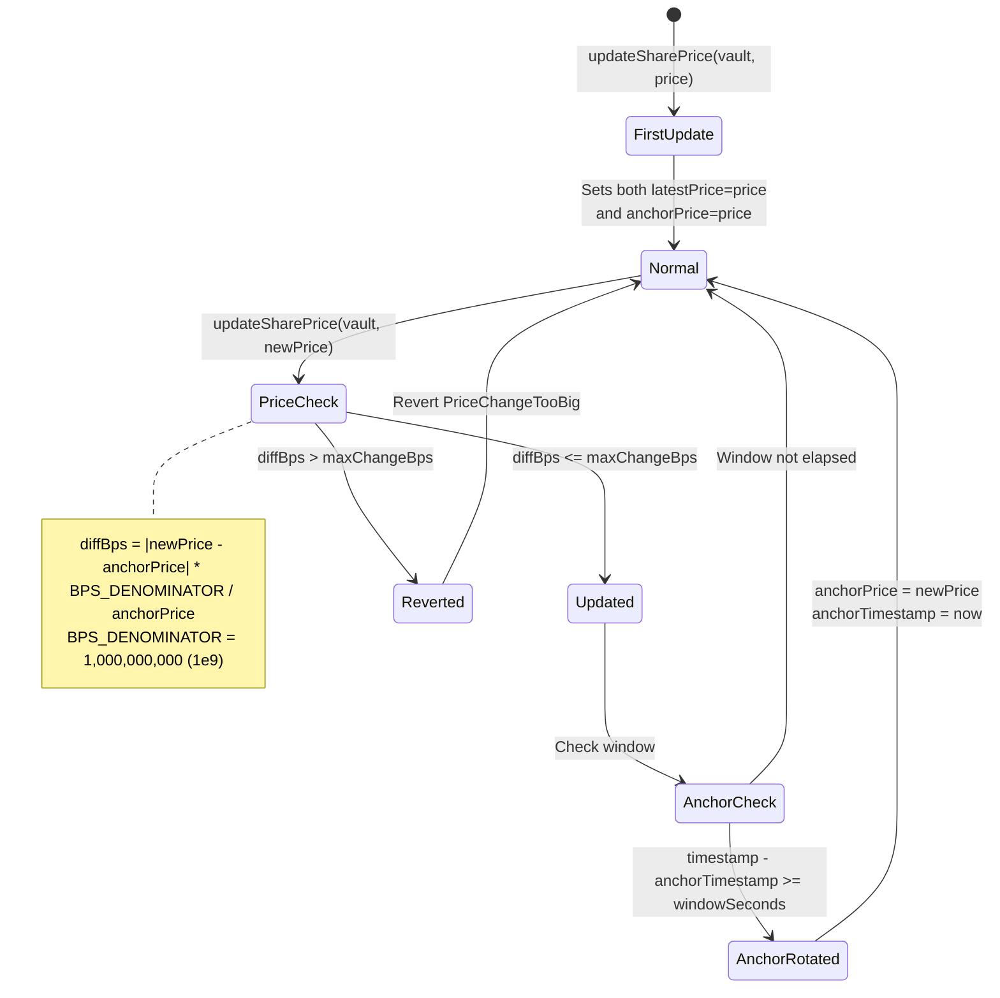
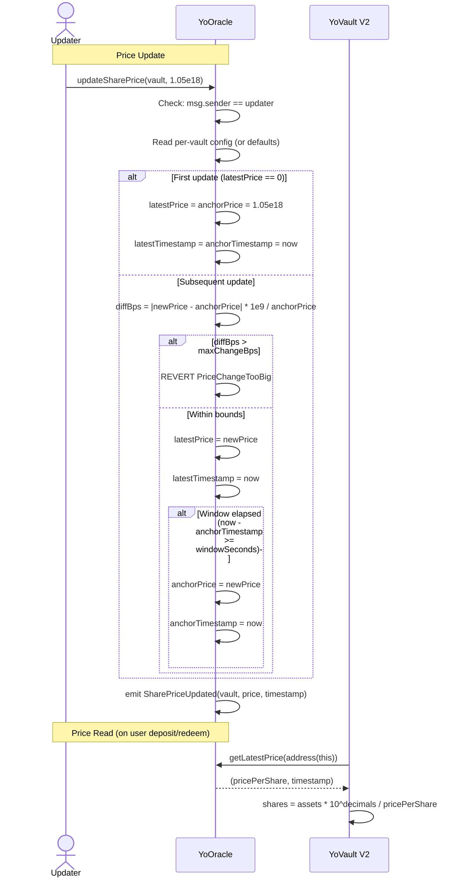
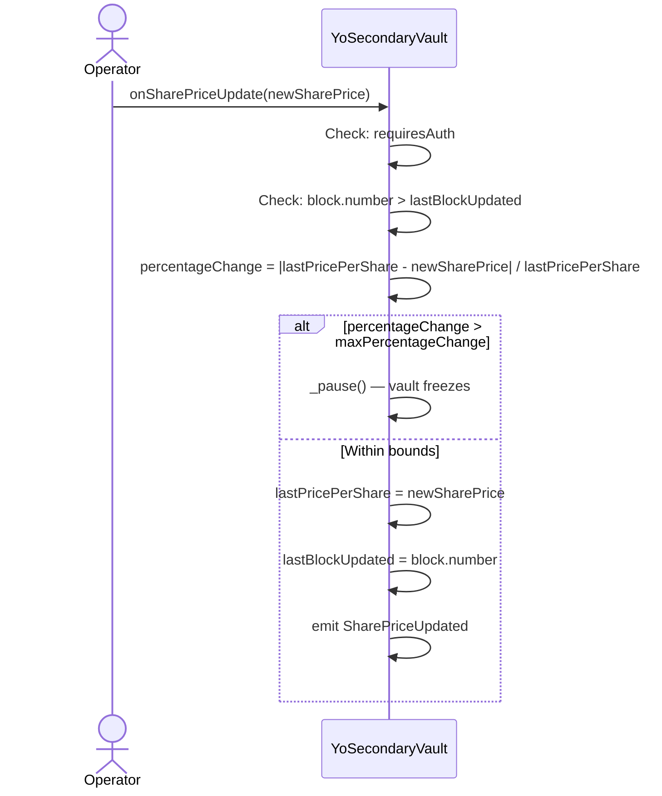

# YO Protocol — Oracle System

## Overview

YO Protocol uses three distinct oracle patterns depending on the vault version. The oracle determines the share price (exchange rate between yoTokens and underlying assets).



---

## Pattern 1: V1 Push-Based (YoVault)

The operator pushes the total off-chain balance to the vault. The vault computes price internally.



### Key Properties

- One update per block maximum (`block.number > lastBlockUpdated`)
- Auto-pause if price change exceeds `maxPercentageChange` (default 1%, max 10%)
- `totalAssets() = IERC20(asset).balanceOf(vault) + aggregatedUnderlyingBalances`
- Standard ERC4626 share conversion: `shares = assets * totalSupply / totalAssets`

---

## Pattern 2: V2 Pull-Based (YoOracle)

A standalone oracle contract stores per-vault share prices. Vaults pull the price on every conversion.

### Oracle Architecture



### Anchor-Based Circuit Breaker

The oracle maintains two price tiers per vault to prevent manipulation:



### Update Flow



### Per-Vault Configuration

The owner can override oracle parameters per vault:

```solidity
oracle.setAssetConfig(
    vaultAddress,
    windowSeconds,    // how often anchor rotates (0 = use default)
    maxChangeBps      // max deviation from anchor (0 = use default)
);
```

| Parameter | Default | Unit | Meaning |
|-----------|---------|------|---------|
| `DEFAULT_WINDOW_SECONDS` | 86,400 (1 day) | seconds | Anchor rotation interval |
| `DEFAULT_MAX_CHANGE_BPS` | 1,000,000 | BPS (1e9 base) | 0.1% max deviation |
| `BPS_DENOMINATOR` | 1,000,000,000 | - | 1e9 (NOT the usual 10,000) |

### V2 Share Conversion

```solidity
// _convertToShares (V2):
(uint256 pricePerShare, ) = IYoOracle(ORACLE_ADDRESS).getLatestPrice(address(this));
shares = assets * 10^decimals / pricePerShare;

// _convertToAssets (V2):
assets = shares * pricePerShare / 10^decimals;

// totalAssets (V2):
(uint256 price, ) = IYoOracle(ORACLE_ADDRESS).getLatestPrice(address(this));
totalAssets = price * totalSupply / 10^decimals;
```

### yoUSDT Oracle Distinction

`yoUSDT` uses `getLatestPrice(YO_USD_ADDRESS)` instead of `getLatestPrice(address(this))`. This means:
- yoUSDT and yoUSD share the **exact same exchange rate**
- The oracle only needs one price entry for both vaults
- Holding yoUSDT or yoUSD gives identical yield exposure

---

## Pattern 3: Secondary Vault Direct Push

For cross-chain secondary instances where the canonical price is computed on another chain.



Note: `onUnderlyingBalanceUpdate()` is **blocked** on secondary vaults — reverts with `UseOnSharePriceUpdate`.

---

## Comparison

| Feature | V1 (YoVault) | V2 (YoOracle) | Secondary |
|---------|-------------|---------------|-----------|
| Price computation | Vault computes from balance | Oracle stores externally | Directly pushed |
| Update trigger | `onUnderlyingBalanceUpdate()` | `updateSharePrice()` on oracle | `onSharePriceUpdate()` |
| Circuit breaker | Auto-pause in vault | `PriceChangeTooBig` revert in oracle | Auto-pause in vault |
| Update frequency | 1 per block | Unlimited (oracle has no block guard) | 1 per block |
| Access control | `requiresAuth` on vault | `updater` address on oracle | `requiresAuth` on vault |
| Upgradeable | Yes (proxy) | No (plain deploy) | Yes (proxy) |
