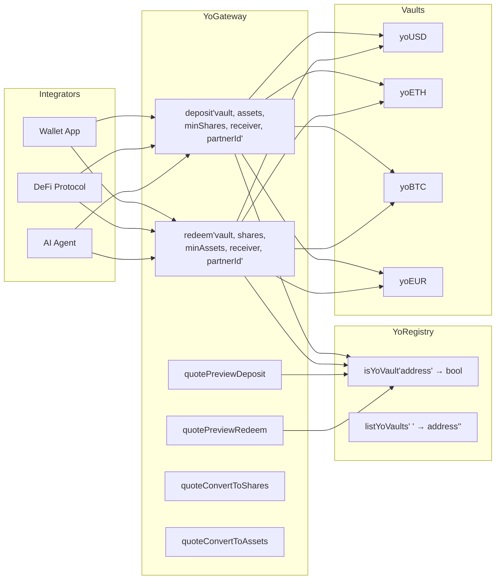
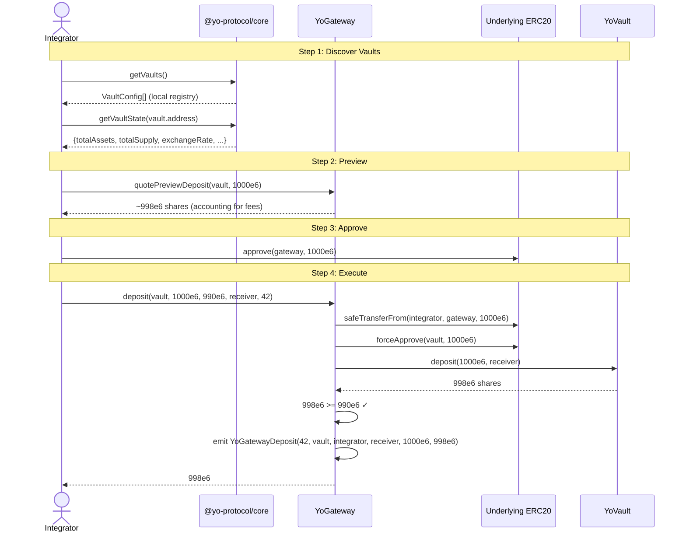
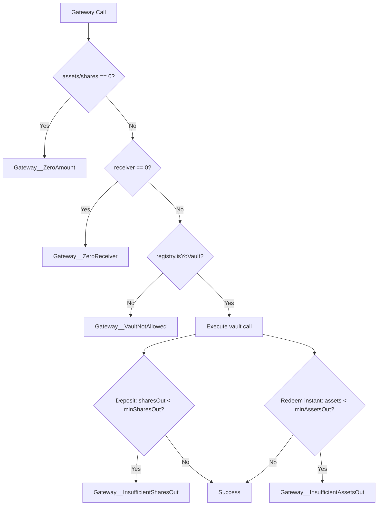

# YO Protocol — Gateway Integration Guide

## Why Use YoGateway?

YoGateway is the **recommended integration point** for all deposits and redemptions:

1. **Single entry point** for all current and future YO vaults
2. **Built-in slippage protection** (`minSharesOut` / `minAssetsOut`)
3. **Partner attribution** via `partnerId` (tracked in events for revenue sharing)
4. **Vault validation** via YoRegistry — only allow-listed vaults accepted
5. **Future-proof** — new vaults are automatically accessible once registered



## Gateway API

### Deposit

```solidity
function deposit(
    address yoVault,        // target vault (must be in registry)
    uint256 assets,         // amount of underlying to deposit
    uint256 minSharesOut,   // minimum shares expected (slippage guard)
    address receiver,       // who receives the yoTokens
    uint32 partnerId        // attribution ID (0 if unregistered)
) external returns (uint256 sharesOut)
```

**Preconditions:**
- User must `approve(gateway, assets)` on the underlying token
- `assets > 0`, `receiver != address(0)`
- Vault must be registered in YoRegistry

**Errors:**
- `Gateway__ZeroAmount` — assets is 0
- `Gateway__ZeroReceiver` — receiver is zero address
- `Gateway__VaultNotAllowed` — vault not in registry
- `Gateway__InsufficientSharesOut(actual, min)` — slippage exceeded

### Redeem

```solidity
function redeem(
    address yoVault,        // target vault
    uint256 shares,         // amount of yoTokens to redeem
    uint256 minAssetsOut,   // minimum assets expected (slippage guard, instant only)
    address receiver,       // who receives the underlying
    uint32 partnerId        // attribution ID
) external returns (uint256 assetsOrRequestId)
```

**Preconditions:**
- User must `approve(gateway, shares)` on the yoToken (vault share token)
- `shares > 0`, `receiver != address(0)`

**Return value:**
- Non-zero = instant redemption (actual assets delivered)
- Zero = async (request queued, `REQUEST_ID = 0`)

**Slippage check** only applies to instant redemptions. For async, set `minAssetsOut = 0`.

### Read-Only Quotes

All quote functions validate the vault via registry first.

```solidity
function quoteConvertToShares(address yoVault, uint256 assets) external view returns (uint256)
function quoteConvertToAssets(address yoVault, uint256 shares) external view returns (uint256)
function quotePreviewDeposit(address yoVault, uint256 assets) external view returns (uint256)
function quotePreviewRedeem(address yoVault, uint256 shares) external view returns (uint256)
function quotePreviewWithdraw(address yoVault, uint256 assets) external view returns (uint256)
function getShareAllowance(address yoVault, address owner) external view returns (uint256)
function getAssetAllowance(address yoVault, address owner) external view returns (uint256)
```

## Integration Flow



## Partner Attribution

The `partnerId` is a `uint32` that appears in gateway events for off-chain tracking:

```solidity
event YoGatewayDeposit(
    uint32 indexed partnerId,    // ← indexed for efficient filtering
    address indexed yoVault,
    address indexed sender,
    address receiver,
    uint256 assets,
    uint256 shares
);
```

- Default `partnerId` in SDK: `9999` (unattributed)
- Partners must register with YO to receive a custom ID
- Used for tracking volumes, revenue sharing, and analytics

## Error Handling



## Contract Addresses

| Contract | Base | Ethereum |
|----------|------|----------|
| **YoGateway** | `0xF1EeE0957267b1A474323Ff9CfF7719E964969FA` | `0xF1EeE0957267b1A474323Ff9CfF7719E964969FA` |
| **YoRegistry** | `0x56c3119DC3B1a75763C87D5B0A2C55E489502232` | `0x56c3119DC3B1a75763C87D5B0A2C55E489502232` |

## Important Notes for Integrators

1. **Approve to Gateway, not Vault** — The gateway pulls tokens from the user and forwards them
2. **Two approvals needed for redeem** — Approve yoTokens (shares) to gateway
3. **Slippage protection** — Always use `quotePreviewDeposit`/`quotePreviewRedeem` to compute min amounts, then subtract a buffer (e.g., 0.5%)
4. **Async redeems have no slippage check** — Set `minAssetsOut = 0` when expecting async
5. **Gas considerations** — Gateway adds ~30k gas overhead vs direct vault interaction due to registry check and token routing
