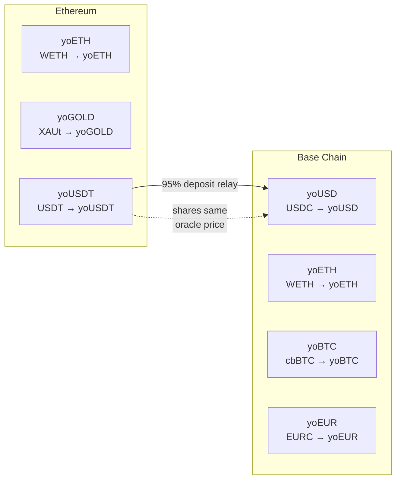

# YO Protocol — Contract Addresses & Vault Registry

## Infrastructure Contracts

| Contract | Base (8453) | Ethereum (1) |
|----------|------------|--------------|
| **YoGateway** | `0xF1EeE0957267b1A474323Ff9CfF7719E964969FA` | `0xF1EeE0957267b1A474323Ff9CfF7719E964969FA` |
| **YoRegistry** | `0x56c3119DC3B1a75763C87D5B0A2C55E489502232` | `0x56c3119DC3B1a75763C87D5B0A2C55E489502232` |
| **YoOracle** | `0x6E879d0CcC85085A709eBf5539224f53d0D396B0` | `0x6E879d0CcC85085A709eBf5539224f53d0D396B0` |
| **RolesAuthority** | `0x9524e25079b1b04D904865704783A5aA0202d44D` | `0x9524e25079b1b04D904865704783A5aA0202d44D` |
| **YO Token** | `0x3C1a1c9C2D073E5bC4e7AF97f0d7caC7a82E2262` | — |
| **Merkl Distributor** | `0x3Ef3D8bA38EBe18DB133cEc108f4D14CE00Dd9Ae` | — |

## Vault Contracts

| Vault | Token | Chain | Vault Address | Underlying Asset | Underlying Address |
|-------|-------|-------|---------------|-----------------|-------------------|
| **yoUSD** | yoUSD | Base | `0x0000000f2eB9f69274678c76222B35eEc7588a65` | USDC | `0x833589fcd6edb6e08f4c7c32d4f71b54bda02913` |
| **yoETH** | yoETH | Base | `0x3a43aec53490cb9fa922847385d82fe25d0e9de7` | WETH | `0x4200000000000000000000000000000000000006` |
| **yoETH** | yoETH | Ethereum | `0x3a43aec53490cb9fa922847385d82fe25d0e9de7` | WETH | `0xc02aaa39b223fe8d0a0e5c4f27ead9083c756cc2` |
| **yoBTC** | yoBTC | Base | `0xbcbc8cb4d1e8ed048a6276a5e94a3e952660bcbc` | cbBTC | `0xcbb7c0000ab88b473b1f5afd9ef808440eed33bf` |
| **yoEUR** | yoEUR | Base | `0x50c749ae210d3977adc824ae11f3c7fd10c871e9` | EURC | `0x60a3E35Cc302bFA44Cb288Bc5a4F316Fdb1adb42` |
| **yoGOLD** | yoGOLD | Ethereum | `0x586675A3a46B008d8408933cf42d8ff6c9CC61a1` | XAUt | `0x68749665FF8D2d112Fa859AA293F07A622782F38` |
| **yoUSDT** | yoUSDT | Ethereum | `0xb9a7da9e90d3b428083bae04b860faa6325b721e` | USDT | — |

## YoEscrow

| Network | Escrow Address | Vault |
|---------|---------------|-------|
| Base | — | yoUSD (`0x0000000f2eB9f69274678c76222B35eEc7588a65`) |

## Vault Relationships



## Underlying Asset Decimals

| Asset | Decimals | Chains |
|-------|----------|--------|
| USDC | 6 | Base, Ethereum |
| WETH | 18 | Base, Ethereum |
| cbBTC | 8 | Base |
| EURC | 6 | Base |
| XAUt | 6 | Ethereum |
| USDT | 6 | Ethereum |

## SDK Vault Registry

Access vaults programmatically:

```typescript
import { VAULTS, getVaultsForChain, getVaultByAddress, YO_GATEWAY_ADDRESS } from '@yo-protocol/core'

// All vaults
console.log(VAULTS.yoUSD)  // { address, underlying: { address: { 1: ..., 8453: ... }, decimals }, ... }

// By chain
const baseVaults = getVaultsForChain(8453)  // [yoUSD, yoETH, yoBTC, yoEUR]
const ethVaults = getVaultsForChain(1)      // [yoETH, yoGOLD, yoUSDT]

// By address
const vault = getVaultByAddress('0x0000000f2eb9f69274678c76222b35eec7588a65')

// Gateway address
console.log(YO_GATEWAY_ADDRESS)  // 0xF1EeE0957267b1A474323Ff9CfF7719E964969FA
```

## On-Chain Discovery

```solidity
// List all registered vaults
address[] memory vaults = IYoRegistry(registryAddress).listYoVaults();

// Check if an address is a valid vault
bool isValid = IYoRegistry(registryAddress).isYoVault(someAddress);

// For each vault, read underlying asset
address asset = IERC4626(vaultAddress).asset();
```
