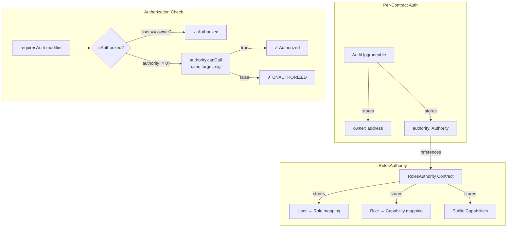
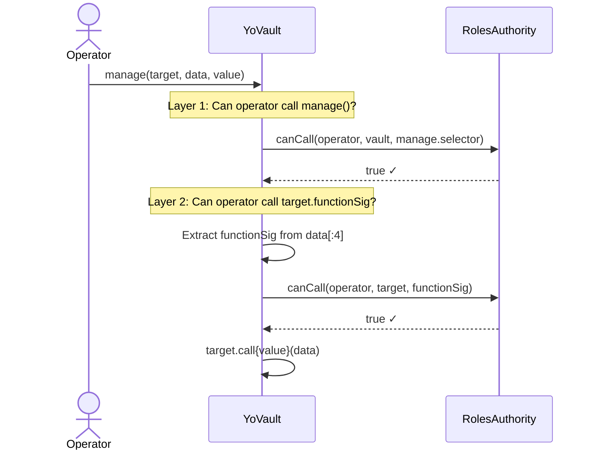

# YO Protocol — Access Control & Roles

## Architecture

YO uses a Solmate-derived `AuthUpgradeable` pattern combined with a `RolesAuthority` for fine-grained permission management.



## AuthUpgradeable

**File:** `src/base/AuthUpgradeable.sol`
**Storage:** ERC-7201 namespaced at slot `0xdd3fd67aef415aded9493b31ad20a02d2991d4bb2760431cc729821271eaea00`

### How `requiresAuth` Works

```solidity
modifier requiresAuth() virtual {
    require(isAuthorized(msg.sender, msg.sig), "UNAUTHORIZED");
    _;
}

function isAuthorized(address user, bytes4 functionSig) public view returns (bool) {
    Authority auth = authority();
    // Owner always authorized
    // OR authority contract approves the call
    return (address(auth) != address(0) && auth.canCall(user, address(this), functionSig))
        || user == owner();
}
```

### Key Functions

```solidity
function setAuthority(Authority newAuthority) public
// Caller must be owner OR current authority must approve
// Does NOT use requiresAuth — direct owner check

function transferOwnership(address newOwner) public requiresAuth
// Requires authorization
```

## Role-Based Authorization

### The `manage()` Double-Check

The vault's `manage()` function has a **two-layer** authorization:



This means an operator with `manage` permission still cannot call arbitrary functions — each target+function combination must be explicitly whitelisted.

## Permission Map

### Functions Gated by `requiresAuth`

| Contract | Function | Description |
|----------|----------|-------------|
| **YoVault** | `fulfillRedeem(receiver, shares, assets)` | Complete async redemption |
| **YoVault** | `cancelRedeem(receiver, shares, assets)` | Return shares to user |
| **YoVault** | `pause()` | Freeze vault operations |
| **YoVault** | `unpause()` | Resume vault operations |
| **YoVault** | `manage(target, data, value)` | Execute arbitrary call from vault |
| **YoVault** | `manage(targets[], data[], values[])` | Batch version |
| **YoVault** | `updateWithdrawFee(newFee)` | Set withdrawal fee |
| **YoVault** | `updateDepositFee(newFee)` | Set deposit fee |
| **YoVault** | `updateFeeRecipient(address)` | Set fee collector |
| **YoVault V1** | `onUnderlyingBalanceUpdate(balance)` | Push oracle update |
| **YoVault V1** | `updateMaxPercentageChange(value)` | Set auto-pause threshold |
| **YoSecondary** | `onSharePriceUpdate(price)` | Push share price |
| **YoRegistry** | `addYoVault(address)` | Register vault |
| **YoRegistry** | `removeYoVault(address)` | Deregister vault |
| **YoToken** | `_update()` (all transfers) | Transfer/mint/burn |
| **AuthUpgradeable** | `transferOwnership(newOwner)` | Change owner |

### Functions NOT Gated (Public)

| Contract | Function | Description |
|----------|----------|-------------|
| **YoVault** | `deposit(assets, receiver)` | Deposit (whenNotPaused) |
| **YoVault** | `mint(shares, receiver)` | Mint (whenNotPaused) |
| **YoVault** | `requestRedeem(shares, receiver, owner)` | Redeem request (whenNotPaused) |
| **YoVault** | `redeem(shares, receiver, owner)` | Redeem alias (whenNotPaused) |
| **YoVault** | All view functions | Read-only state |
| **YoGateway** | `deposit(...)` | Route deposit |
| **YoGateway** | `redeem(...)` | Route redeem |
| **YoGateway** | All quote functions | Read-only |
| **YoRegistry** | `isYoVault(address)` | Check registration |
| **YoRegistry** | `listYoVaults()` | List all vaults |
| **YoOracle** | `getLatestPrice(vault)` | Read price |
| **YoOracle** | `getAnchor(vault)` | Read anchor |

### YoOracle Access (Different Pattern)

YoOracle uses `Ownable2Step` (not `AuthUpgradeable`):

| Function | Access | Description |
|----------|--------|-------------|
| `setUpdater(address)` | `onlyOwner` | Change price pusher |
| `setAssetConfig(vault, window, maxBps)` | `onlyOwner` | Configure per-vault params |
| `updateSharePrice(vault, price)` | `updater` only | Push price update |

## Role Setup Pattern (from tests)

```solidity
// 1. Deploy authority
MockAuthority authority = new MockAuthority(admin, Authority(address(0)));

// 2. Attach to vault
vault.setAuthority(authority);

// 3. Grant role to operator
authority.setUserRole(operatorAddress, ADMIN_ROLE, true);  // ADMIN_ROLE = 1

// 4. Grant capabilities for specific operations
// For manage() to call ERC20.transfer on USDC:
authority.setRoleCapability(ADMIN_ROLE, usdcAddress, IERC20.transfer.selector, true);

// For manage() to call escrow.withdraw:
authority.setRoleCapability(ADMIN_ROLE, escrowAddress, YoEscrow.withdraw.selector, true);
```

## Deployed Authority

| Chain | Authority Address |
|-------|------------------|
| Base | `0x9524e25079b1b04D904865704783A5aA0202d44D` |
| Ethereum | `0x9524e25079b1b04D904865704783A5aA0202d44D` |

## Security Properties

1. **Owner = god mode** — Owner bypasses all authority checks. Always authorized.
2. **Authority = optional** — If `address(0)`, only owner has access. Most restrictive default.
3. **ERC-7201 storage** — Auth state survives proxy upgrades safely.
4. **Double-gated `manage()`** — Even authorized operators can only call pre-approved target+function combinations.
5. **Pause cascade** — When paused, ALL ERC20 operations are blocked (including user-to-user transfers), not just vault operations.
6. **Oracle pause** — V1 auto-pauses on price deviation. V2 oracle reverts instead of pausing.
